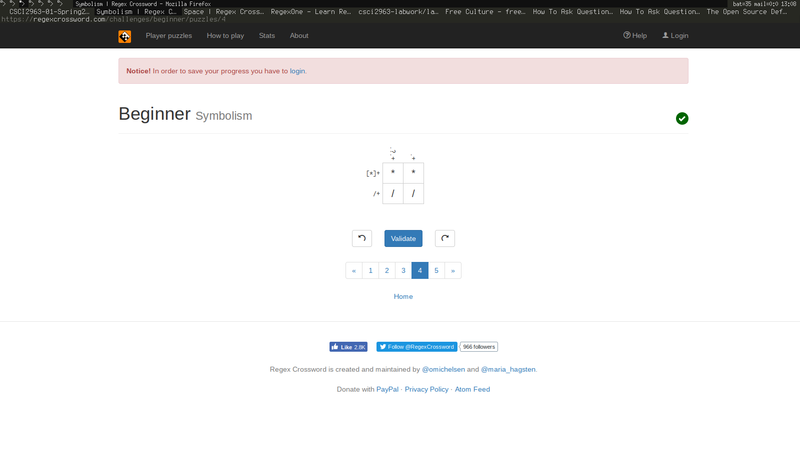

Reading Assignments
===================

The Open Source Definition
--------------------------
Being familiar with Richard Stallman's Free Software movement, I was struck by the ideological "softness" (for lack of a better word) of the Open Source Definition. Particularly, if I am interpreting point nine, which states that open source software must not place restrictions upon other software distributed upon the same medium, correctly, this calls to mind some frequent debate surrounding the GNU GPL: namely, that a program that uses a GPL software library must also be licensed under the GPL. Within the Free Software movement, this has lead to the creation of alternate licenses such as the LGPL. I would posit that these differences reflect underlying differences in the projects' motivations. The Open Source movement seems to me to be primarily concerned with the development of better software using collaboration as a tool, where Free Software is more about the modification and examination of software being a fundamental human right.

How To Ask Questions The Smart Way
----------------------------------
How to answer questions helpfully:

1) Empathize with the person asking the question. Often, new community members tend to become frustrated if they are unable to find a solution. It is important in these cases to realize and understand this frustration and provide data in a non-combative manner that will not elevate the situation.

2) Reward high-effort questions. In especially busy project IRC/Slack channels, there is often a glut of questions, more than what can be feasibly answered. Preferentially answering questions from those users that do their research, use proper grammar, conform to project convention, and in general are polite and earnest ensures that your community continues to operate effectively.

Free Culture
------------
Reading the story of Jesse Jordan gave me some new perspective on the rather well-known Rensselaer music piracy incident of the early 2000s. Although the incident is well known to many of the more tech-savvy students, frequently being cited in discussions of Institute policy on internet piracy, I had not previously been privy to the details. The situation mirrors a common one today, now associated with the more recent plague of so-called "patent trolls": the prohibitive cost of legal action effectively allows any corporation to bully almost any individual (barring the most wealthy) with impunity. Internet copyright and patent law in America today seems almost a perfect storm for this sort of extortion, what with its combination of an ephemeral good that costs near to nothing to distribute, massive hourly legal fees, and legal loopholes that allow knowledgeable corporate lawyers to prolong cases for years, laying siege to their opponents' meager wallets. In Jesse Jordan's case, the typical patent troll victory was foreshadowed a decade in advance: it was simply too expensive for the accused to go to court, even if they were legally in the right, so they were forced to effectively "pay off" the accuser. Perhaps if more people had witnessed this very case and others like it at the time, the situation would be different today. Organizations like the RIAA and contemporary patent trolls cannot be allowed to sustain themselves with extortion and legal trickery.

Linux
=====

Regex
=====

Snap/CSDT/Blockly
=================

Reflection
==========

A field I am interested in is programming language theory. I have contributed to Python and Elixir, and written a , but my main interest currently is the use of ideas found in  to enhance functional programming. More specifically, I would like to combine the ideas found in older system-level languages like  with modern higher-order programming techniques and a powerfull and expressive type system like that found in .

My current progress can be found . It consists of a Haskell implementation of a polymorphic, dependently-typed lambda calculus with type operators (the closest relative to this would be the ), alongside a concatenative language that compiles to that calculus. A brief summary of this work follows:

My core language consists of four different terms:
 - Words (identifiers, e.g. `foo`, `+`)
 - Literals (e.g. `1`, `"hello, world"`)
 - Blocks (a joint list/function type, e.g. `{1 +}`, `{"hello" "world"}`)
 - List Type (like a block, but evaluate the contained code within the type context)

I include some primitive words like `*`, which represents the type of a type. (There are some consequences from the type of `*` being `*` instead of some hierarchically "higher" `*1` (for example), which ultimately lead to the thing being impractical as a proof assistant, but I'm not too concerned with this at the moment as it affects usability).

This underlying calculus has 11 terms. It's unusual among functional languages that the core calculus is more complex than the compiled language, but simplicity is one of the core goals here so it's probably fine.
 - Star (the type of type)
 - Unit Type (the type holding one and only one value. This is the NULL type in Common Lisp or the 0-element tuple type in Haskell)
 - Variable Access
 - Function Application
 - Lambda (create a function (an instance of the Pi type))
 - Cons (create a 2-tuple (an instance of the Sigma type))
 - Unit (the single value of type Unit Type)
 - First (first element in a Cons)
 - Second (second element in a Cons)
 - Pi (the dependent product type)
 - Sigma (the dependent sum type)
 - Case (used for pattern matching and conditionals, a performance concession)

The Pi and Sigma types are the two "primitive" type operators, allowing the creation of functions and tuples, both of which allow the second type to depend upon the value of the first. For example, say you had a function f from integers to types that returned the Integer type when passed a 0 and the String type when passed any other value (this can be implemented in practice trivially using pattern matching). Using this function, a function from Integer to either Integer or String based on f could be give a type in the core calculus as `Pi Integer f`: a function from integer to the result of f. Of course, ordinary functions can be given types very easily by simply using an "f" that disregards its input and always returns a specific type. For example, a function from String to Integer in both Haskell and this calculus:

Haskell: `String -> Integer`

This: `Pi String (Lambda String Integer)`

where Lambda String Integer is a function taking a string as input and returning the type Integer. Of course, this doesn't reflect long-term syntax, just the representation currently being used for the core calculus.

The same general principle holds for Sigma, which creates tuples where the type of the second element depends upon the first. The Sigma type could have been written in terms of the Pi type (and was originally), but since tuples are used so widely throughout the language I made them atomic for performance.

This is all that is needed for a full-featured dependent type system: any sort of ADT can be constructed using Pi (the product or logical or, which is sort of a reversal from usual but this stuff is weird in lots of ways) and Sigma (the sum or logical and).
