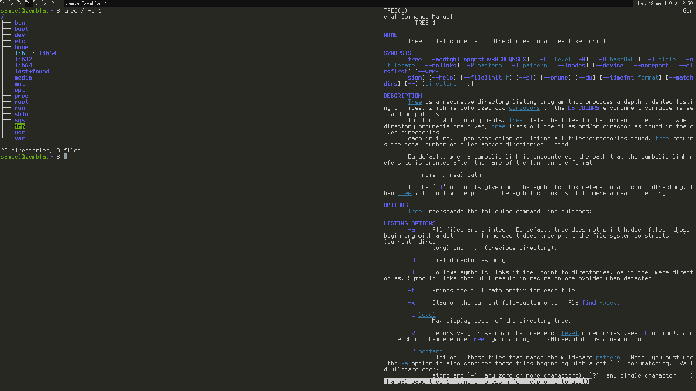

Reading Assignments
===================

The Open Source Definition
--------------------------
Being familiar with Richard Stallman's Free Software movement, I was struck by the ideological "softness" (for lack of a better word) of the Open Source Definition. Particularly, if I am interpreting point nine, which states that open source software must not place restrictions upon other software distributed upon the same medium, correctly, this calls to mind some frequent debate surrounding the GNU GPL: namely, that a program that uses a GPL software library must also be licensed under the GPL. Within the Free Software movement, this has lead to the creation of alternate licenses such as the LGPL. I would posit that these differences reflect underlying differences in the projects' motivations. The Open Source movement seems to me to be primarily concerned with the development of better software using collaboration as a tool, where Free Software is more about the modification and examination of software being a fundamental human right.

How To Ask Questions The Smart Way
----------------------------------
How to answer questions helpfully:

1) Empathize with the person asking the question. Often, new community members tend to become frustrated if they are unable to find a solution. It is important in these cases to realize and understand this frustration and provide data in a non-combative manner that will not elevate the situation.

2) Reward high-effort questions. In especially busy project IRC/Slack channels, there is often a glut of questions, more than what can be feasibly answered. Preferentially answering questions from those users that do their research, use proper grammar, conform to project convention, and in general are polite and earnest ensures that your community continues to operate effectively.

Free Culture
------------
Reading the story of Jesse Jordan gave me some new perspective on the rather well-known Rensselaer music piracy incident of the early 2000s. Although the incident is well known to many of the more tech-savvy students, frequently being cited in discussions of Institute policy on internet piracy, I had not previously been privy to the details. The situation mirrors a common one today, now associated with the more recent plague of so-called "patent trolls": the prohibitive cost of legal action effectively allows any corporation to bully almost any individual (barring the most wealthy) with impunity. Internet copyright and patent law in America today seems almost a perfect storm for this sort of extortion, what with its combination of an ephemeral good that costs near to nothing to distribute, massive hourly legal fees, and legal loopholes that allow knowledgeable corporate lawyers to prolong cases for years, laying siege to their opponents' meager wallets. In Jesse Jordan's case, the typical patent troll victory was foreshadowed a decade in advance: it was simply too expensive for the accused to go to court, even if they were legally in the right, so they were forced to effectively "pay off" the accuser. Perhaps if more people had witnessed this very case and others like it at the time, the situation would be different today. Organizations like the RIAA and contemporary patent trolls cannot be allowed to sustain themselves with extortion and legal trickery.

Linux
=====

Regex
=====

Snap/CSDT/Blockly
=================

Reflection
==========
