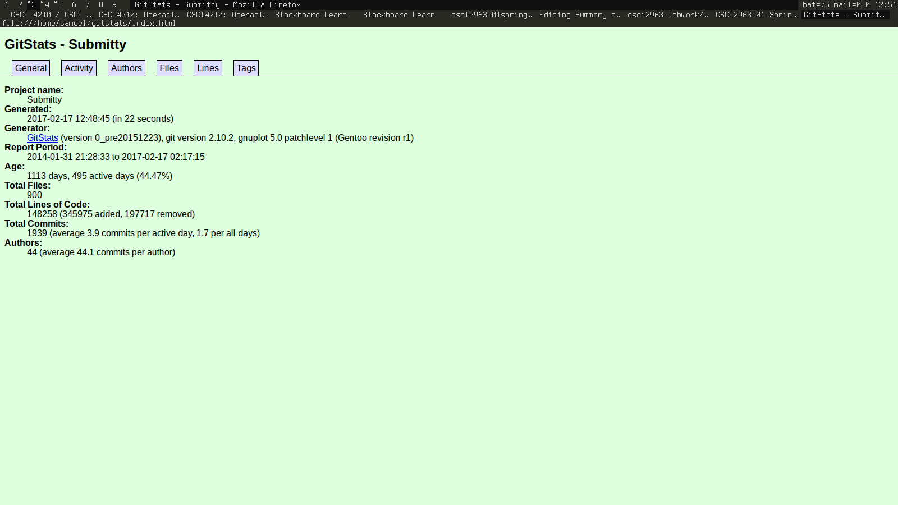
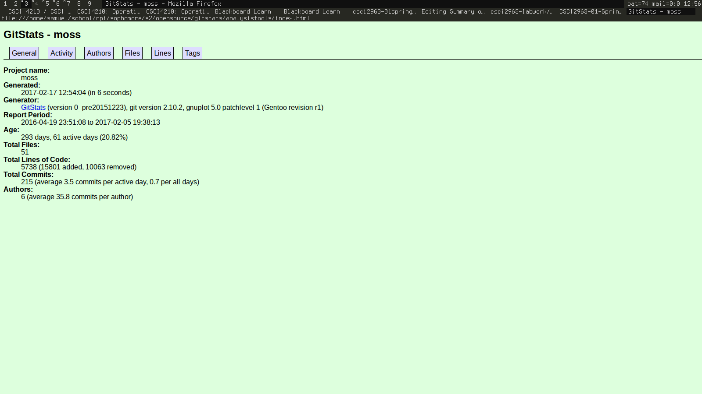

Submitty/Submitty Stats
-----------------------

Number of contributors: 44

Lines of code: 202668

First commit: d81d95fb1a40065889567e084fcb6bf92ff7cace

Latest commit: 07c2c33cc5519b8c626e5bb1182bf212e61c6c0e

Current branches: `an_rcos, analysis_tools, count_function, goto_auto_check, master, sample_assignment_typo_fix`

gitstats: 

Submitty/AnalysisTools Stats
----------------------------

Number of contributors: 6

Lines of code: 5738

First commit: e4948134c63fc7fc6583cf77cf7a73405ed518f3

Latest commit: fac09146bb531c8a08b6f99512966b0a82761dc0

Current branches: `3_4, aug_assign, count_function, documentation, function_python_fix, java_layout, master, multi_file, plagiarism_layout, unicode, unterminated_comment`

gitstats: 
