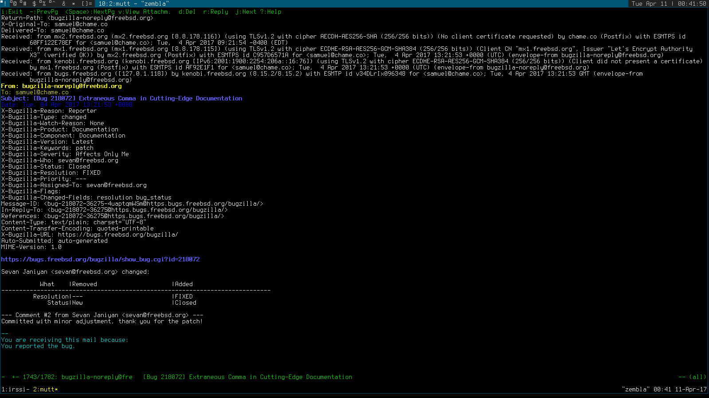

[Bug](https://bugs.freebsd.org/bugzilla/show_bug.cgi?id=218072)

For this lab, I removed a single unnecessary comma from the FreeBSD documentation.

Good documentation is important in general, but it is especially important in open-source projects in order to create a healthy working environment and to encourage contribution.
Good documentation contributes to an overall feeling of organization and polish that attracts both users and contributors, beyond the obvious functional benefits (that is, users have some idea about how to use the system).

Over the course of this lab, something that I apparently needed to learn was that the UNIX philosophy is barely compatible with the modern web.
Although I managed to successfully submit a patch without using bloated modern software or compromising my freedom, it was a difficult experience.
I am accustomed to using mostly sites that play nicely with my workflow, and this was an unfortunate reminder that many, many services are simply unusable without images/JavaScript/CSS/other "Web 2.0" bloat.

    --- handbook/cutting-edge/chapter.xml   (working copy)	
    +++ handbook/cutting-edge/chapter.xml   (working copy)	
    @@ -1704,7 +1704,7 @@ 
            replace the current file with the new one.  For most
            unmodified files, this is the best option.</para>
    -      <para>Choosing to merge the file will present a text editor, and
    +      <para>Choosing to merge the file will present a text editor and
            the contents of both files.  The files can be merged by
            reviewing both files side by side on the screen, and choosing
            parts from both to create a finished product.  When the files

